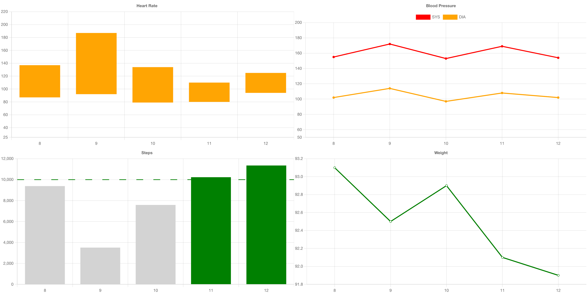

# React Healthcare Charts

Example of several React components that leverage fetting Liferay Object data.

### Expected Use

This resource can be used as a 7.4 Remote App (Custom Element) or a Client Extension service for LXC.

## Heart Rate Chart

### Create the required Lifeary Objects

1. Create Object named:

- Label: "Heart Rate"
- Pural Label: "Heart Rate"
- Object Name: "HeartRate"
- Note: This object represents a list of heart rate readings recorded for the current Liferay user.

2. Object Needs the Fields

| Field Name  | Label        |  Type   | Required |
| :---------- | :----------- | :-----: | :------: |
| lowest      | Lowest       | Integer |   Yes    |
| highest     | Highest      | Integer |   Yes    |
| readingDate | Reading Date |  Date   |   Yes    |

3. Object Relationships

| Field Name         | Label |    Type     | Required |
| :----------------- | :---: | :---------: | -------- |
| r_heartRate_userId | User  | One to Many | Yes      |

Note: The object should be created from the User object

4. Publish the new HeartRate Object

### Add sample data to the Lifeary Objects

1. Add a few rate records for the component to use:

| User | Reading Date  | Lowest | Highest |
| :--- | :------------ | -----: | ------: |
| Test | 8th Jan 2023  |     87 |     137 |
| Test | 9th Jan 2023  |     92 |     187 |
| Test | 10th Jan 2023 |     79 |     134 |
| Test | 11th Jan 2023 |     80 |     110 |
| Test | 12th Jan 2023 |     94 |     125 |

## Blood Pressure Chart

### Create the required Lifeary Objects

1. Create Object named:

- Label: "Blood Pressure"
- Pural Label: "Blood Pressure"
- Object Name: "BloodPressure"
- Note: This object represents a list of blood pressure readings recorded for the current Liferay user.

2. Object Needs the Fields

| Field Name  | Label        |  Type   | Required |
| :---------- | :----------- | :-----: | :------: |
| diastolic   | Diastolic    | Integer |   Yes    |
| systolic    | Systolic     | Integer |   Yes    |
| readingDate | Reading Date |  Date   |   Yes    |

3. Object Relationships

| Field Name             | Label |    Type     | Required |
| :--------------------- | :---: | :---------: | -------- |
| r_bloodPressure_userId | User  | One to Many | Yes      |

Note: The object should be created from the User object

4. Publish the new BloodPressure Object

### Add sample data to the Lifeary Objects

1. Add a few rate records for the component to use:

| User | Reading Date  | Diastolic | Systolic |
| :--- | :------------ | --------: | -------: |
| Test | 8th Jan 2023  |       102 |      155 |
| Test | 9th Jan 2023  |       114 |      172 |
| Test | 10th Jan 2023 |        97 |      153 |
| Test | 11th Jan 2023 |       108 |      169 |
| Test | 12th Jan 2023 |       102 |      154 |

## Steps Chart

### Create the required Lifeary Objects

1. Create Object named:

- Label: "Step"
- Pural Label: "Steps"
- Object Name: "Steps"
- Note: This object represents a list of step counts recorded for the current Liferay user.

2. Object Needs the Fields

| Field Name  | Label        |  Type   | Required |
| :---------- | :----------- | :-----: | :------: |
| stepCount   | Step Count   | Integer |   Yes    |
| readingDate | Reading Date |  Date   |   Yes    |

3. Object Relationships

| Field Name     | Label |    Type     | Required |
| :------------- | :---: | :---------: | -------- |
| r_steps_userId | User  | One to Many | Yes      |

Note: The object should be created from the User object

4. Publish the new Steps Object

### Add sample data to the Lifeary Objects

1. Add a few rate records for the component to use:

| User | Reading Date  | Step Count |
| :--- | :------------ | ---------: |
| Test | 8th Jan 2023  |       9384 |
| Test | 9th Jan 2023  |       3509 |
| Test | 10th Jan 2023 |       7584 |
| Test | 11th Jan 2023 |      10234 |
| Test | 12th Jan 2023 |      11352 |

## Weight Chart

### Create the required Lifeary Objects

1. Create Object named:

- Label: "Weight"
- Pural Label: "Weight"
- Object Name: "Weight"
- Note: This object represents a list of recorded weights for the current Liferay user.

2. Object Needs the Fields

| Field Name  | Label        |  Type   | Required |
| :---------- | :----------- | :-----: | :------: |
| weight      | Weight       | Decimal |   Yes    |
| readingDate | Reading Date |  Date   |   Yes    |

3. Object Relationships

| Field Name      | Label |    Type     | Required |
| :-------------- | :---: | :---------: | -------- |
| r_weight_userId | User  | One to Many | Yes      |

Note: The object should be created from the User object

4. Publish the new Weight Object

### Add sample data to the Lifeary Objects

1. Add a few rate records for the component to use:

| User | Reading Date  | Step Count |
| :--- | :------------ | ---------: |
| Test | 8th Jan 2023  |       93.1 |
| Test | 9th Jan 2023  |       92.5 |
| Test | 10th Jan 2023 |       92.9 |
| Test | 11th Jan 2023 |       92.1 |
| Test | 12th Jan 2023 |       91.9 |

## Clone Repo and Install Packages

Clone repo and once ready run the following:

yarn install

# Display Method Options

- Delivery Method A - Remote App's Custom Element

  - [Option 1] Javascript Resources Hosted on Remote Server or LXC Client Extension Service
  - [Option 2] Javascript Resources Hosted on Liferay Server in webapps
  - [Option 3] Javascript Resources Added to Document Library

## Setup Instruction

Include these in your Remote App or LXC Client Extension Service definition.

| Field             | Value                |
| :---------------- | :------------------- |
| HTML Element Name | healthcare-component |
| URL               | path to main.js      |
| CSS URL           | path to main.css     |

- Delivery Method B - Use as separate React App (Make sure to set the CORs Policy to support this approach if on a separate domain)
- Delivery Method C - Remote App's iFrame (Make sure to set the CORs Policy to support this approach if on a separate domain

## Chart Types

By default the Heart Rate Chart will be displayed. To use the others, it is necessary to set the route as part of the Remote App instance Properties.

| Chart          | Route          |
| :------------- | :------------- |
| Heart Rate     | heart-rate     |
| Blood Pressure | blood-pressure |
| Steps          | steps          |
| Weight         | weight         |

### Properties

- _route_ : 'heart-rate' | 'blood-pressure' | 'steps' | 'weight', default if not provided =  'heart-rate'
- _startDate_ : date in ISO format, i.e. 'YYYY-MM-DD', default if not provided is today's date
- _endDate_ : date in ISO format, i.e. 'YYYY-MM-DD', default if not provided is startDate plus 7 days
- _maxEntires_ : integer, default if not provided is 7
- _targetSteps_ : integer, default if not provided is 10000
